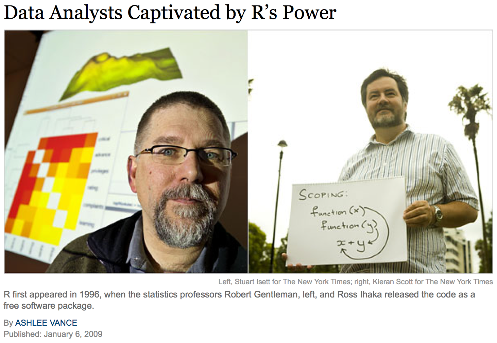
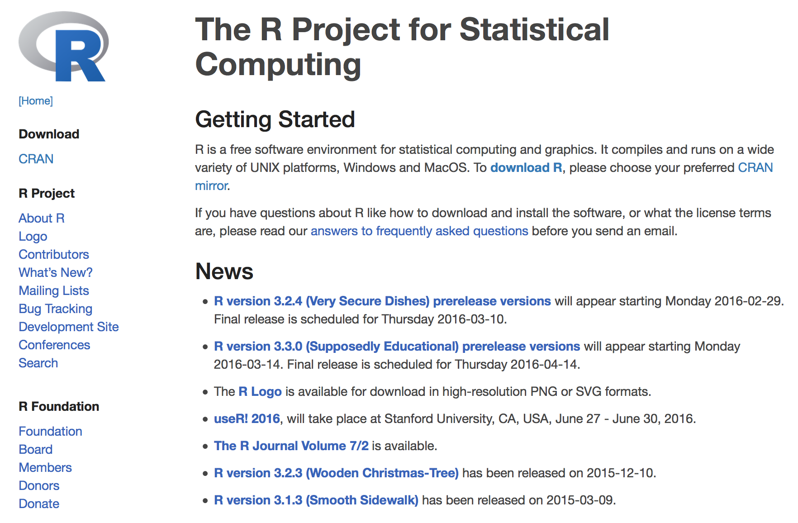
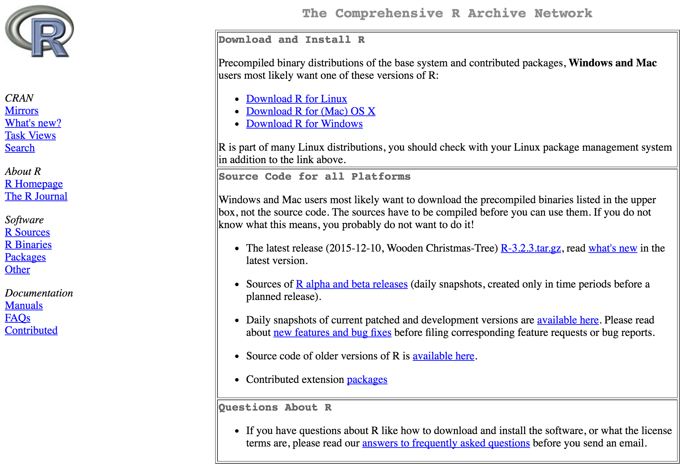
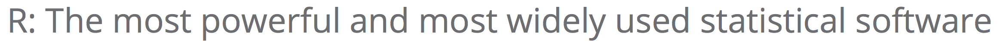
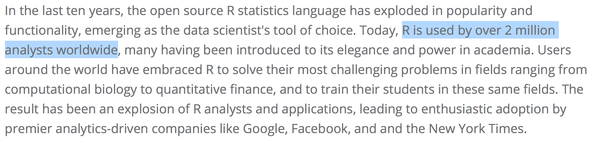
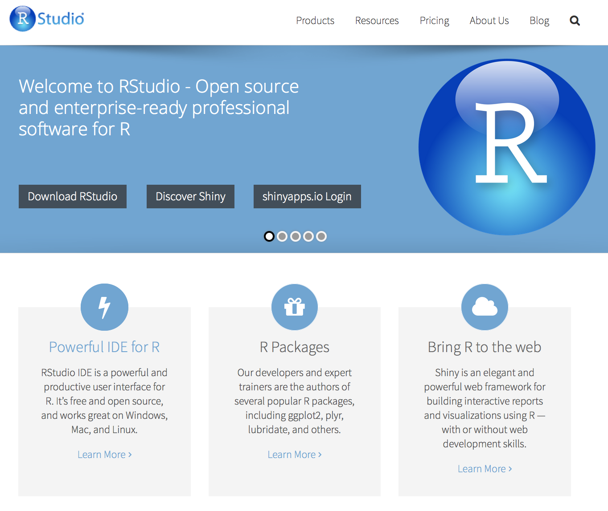

## Overview - workshop

URL: https://github.com/mikblacklab/Biochem_R_training

 - Monday Session 1 - 9:30am-12:30pm (Mik/James)
     - R/RStudio overview
     - Data organisation & import 
 - Monday Session 2 - 1:30pm-4:30pm (Murray/Tom/Tanya) 
     - Introduction to R 
 - Tuesday Session 3 - 9:30am-12:30pm (Murray/Elizabeth/Tanya)
     - Data manipulation & visualisation 
 - Tuesday Session 4 - 1:30pm-4:30pm (Mik/James)
     - Reproducible research with Rmarkdown

## Overview - session 1

 - Why are you here?
 - Introductions 
     - instructors
     - material 
     - each other
 - Etherpad
 - Introducing R & RStudio
 - Data organisation (James)
 - Importing data into R (James)

## Why are you here?

 - Reason 1: we are offering a workshop
 - Reason 2: you think you need to know the things we are teaching
 - Motivation behind both:
     - our disciplines are becoming much more "data-centric"
     - relevant analytic tools are always evolving, so are not available in canned, 
     easy-to-use software applications
     - there is movement internationally towards increasing the "digital literacy" of
     early-career researchers through formal training workshops outside the current 
     academic curriculum.

## Introductions: instructors 

In order of appearance:

 - Mik Black
 - James Boocock 
 - Murray Cadzow 
 - Tanya Flynn
 - Tom Kelly 
 - Elizabeth Permina

 
## Introductions: the material

 - We will be teaching you very basic concepts in data organisation, manipulation and visualisation
 - We are using the R language, which we interact with through the RStudio interface
 - Some of the material we are using has come from the following sources:
    - Data Carpentry: http://www.datacarpentry.org/
    - Software Carpentry: http://software-carpentry.org/
 - Both of the above sites are excellent sources of information if you are looking to improve your ability to perform basic data analysis, or get more into programming.

## Introductions: each other

 - Show of hands
     - where are people from?
     - what are you working on?
 - Have a chat to your neighbours
 
## Etherpad

 - Etherpad is a tool from Mozilla that allows real-time collaborative document 
 editing within a browser.
     - [Workshop Etherpad link](https://public.etherpad-mozilla.org/p/2016-02-22_Otago_Biochem)
 - We can use Etherpad during the workshop for lots of things:
     - collecting attendance info
     - taking notes
     - asking questions
     - sending information
 - You can set up your own Etherpad (note that anyone with the link can see it) via Mozilla:
     - https://public.etherpad-mozilla.org/

## Introducing R

 - R is a programming language for statistical analysis
     - based on the S language written by John Chambers in the 1980s.
     - developed under an open source (i.e., free) model at the University of Auckland by Ross Ihaka and Robert Gentleman
 - Rapidly grew to be the preferred tool for statisticians around the world
     - international team of core developers
     - thousands of contributing programmers from all over the world
 - Now used for data analysis in many fields.

## The original R's

<center></center>

http://www.nytimes.com/2009/01/07/technology/business-computing/07program.html?pagewanted=all


## The R project

<center></center>

https://www.r-project.org/

## Getting R (locally)

<center></center>

<BR>
http://cran.stat.auckland.ac.nz/

## R is popular...

<center></center>
<BR>
<center></center>
<BR>

http://www.revolutionanalytics.com/content/r-most-powerful-and-most-widely-used-statistical-software

## Why are we teaching R?

 - R provides an attractive and (somewhat) simple platform for data manipulation and analysis:
     - Free Open Source Software (FOSS) from an international developer community
     - Hugely extendable through downloadable packages
     - For a lot of people, R is all they will ever need for data manipulation, 
     analysis and visualisation
 - R also provides a good environment for learning basic (and advanced) programming concepts.

## Introducing RStudio

The free RStudio application provides an "integrated development environment" (IDE) for working in R.

<center></center>

https://www.rstudio.com/

## What does it look like?

<center></center>

## Getting started with R

 - Open RStudio and spend some time getting familiar with the layout:
      - Console: type commands here
      - Source: save your code here
      - Environment/History: session info
      - Files/Plots/Packages/Help/Viewer: everything else  :)
 - You can write commands/code in the source pane, and then "submit" it (i.e., run it)
 in the console by hitting `Ctrl+Enter`.
 - Comments start with `#` and are ignored by R
 
## Getting started with R


```{r}
# This is a comment

# This adds 3 + 5
3 + 5

# This adds 3 + 2 and assigns it to an object called "a"
a = 3 + 2

# This shows the value of "a"
a
```

## Getting started with R

```{r}
# This also adds 3 + 2 and assigns it to an object called "a"
a <- 3 + 5
a

# This takes the object "a", and adds 10 to it
a + 10

# This calculates the square root of "a"
# sqrt is called a "function" - we'll use functions a lot
sqrt(a)
```

## Lets do something useful

 - While it is fun to use R as a giant calculator, that's not going to help (much) with your research.
 - We want to do some data analysis in R
      - First, we need data
      - Good, clean, well-organised data
 - Go James, go!